Usage of Install Media OC.app to create a bootable USB install media for macOS Tahoe 26
- Use a minimum 32 gig USB drive media
- SIP security and Gatekeeper must be disabled.
  
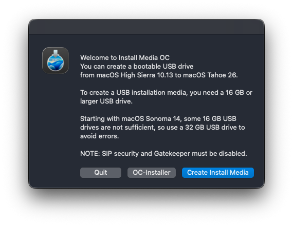
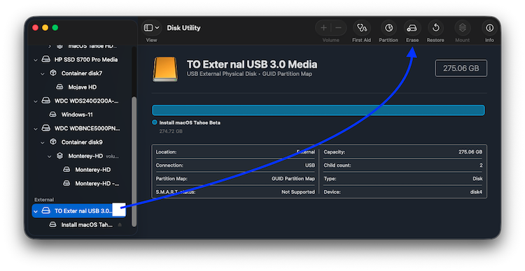
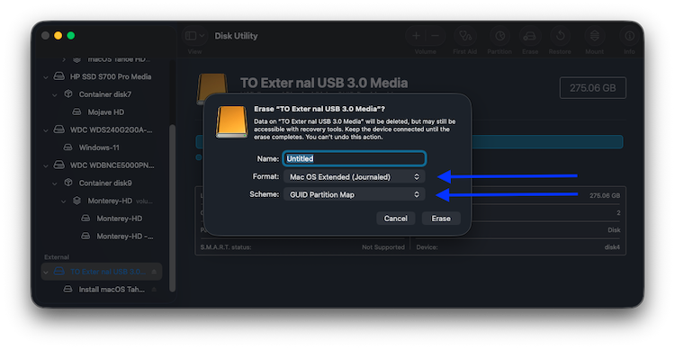
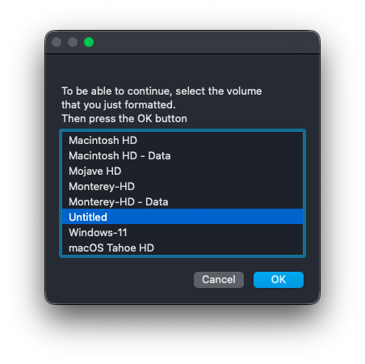
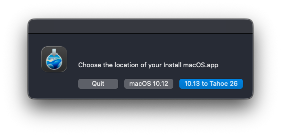
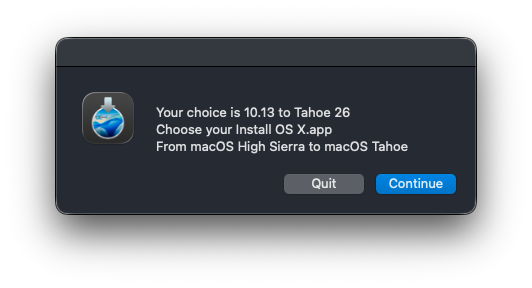

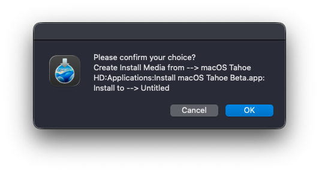

### Wait until the process is complete, it may take 25 minutes depending on the speed of your USB key

⬇︎

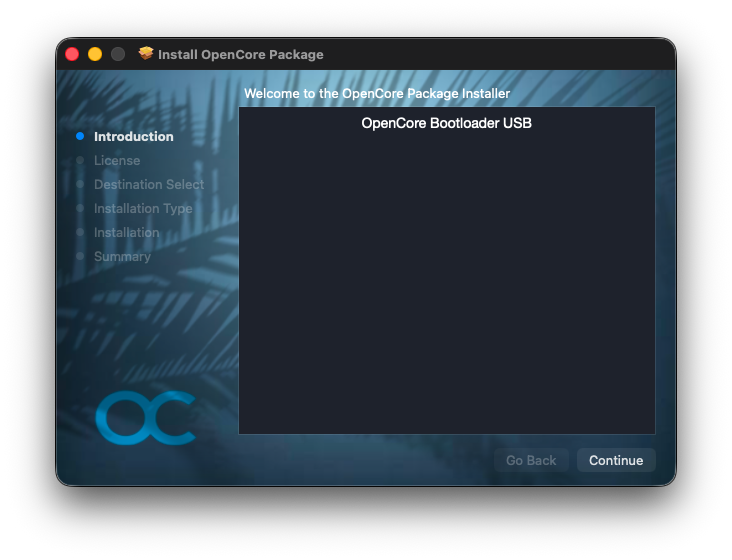
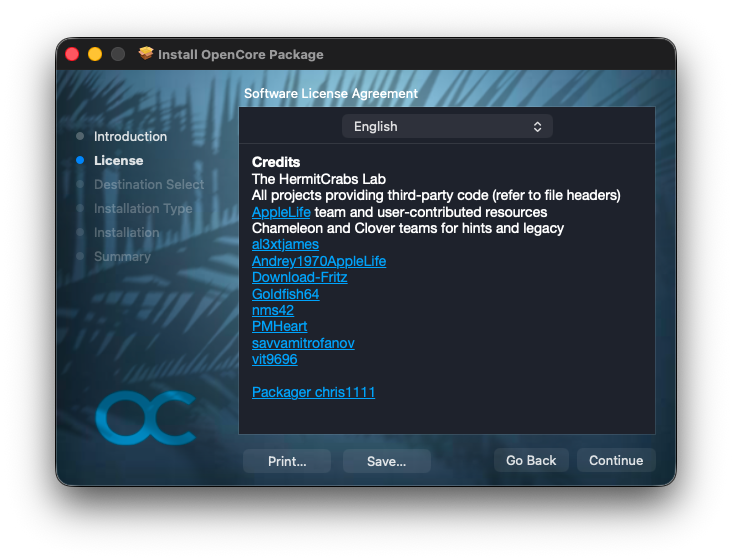
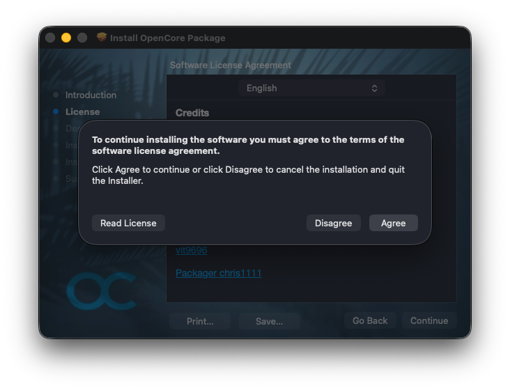
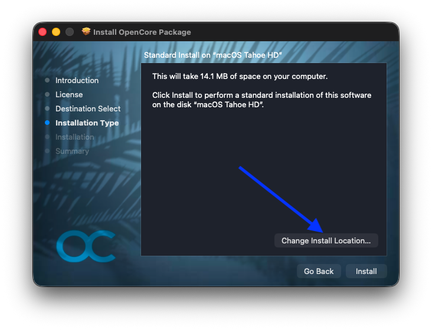
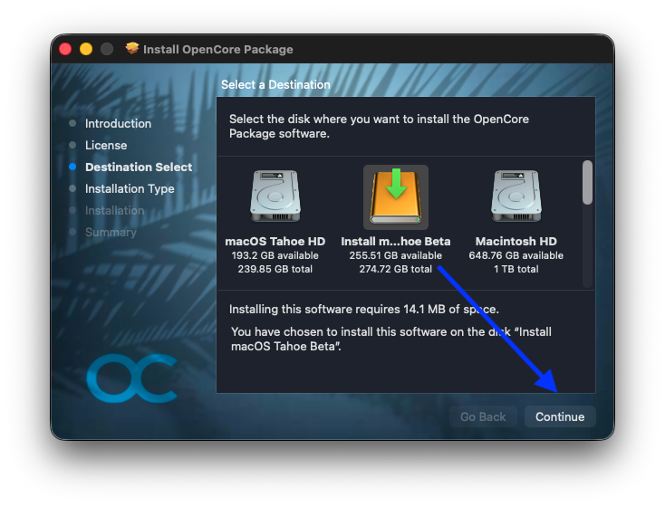
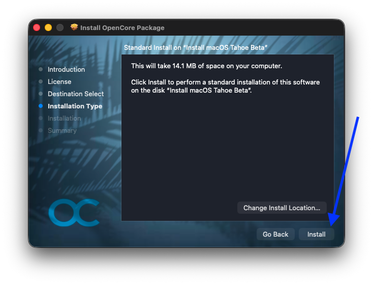

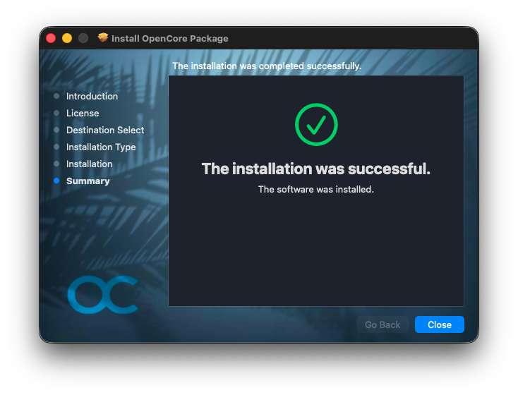
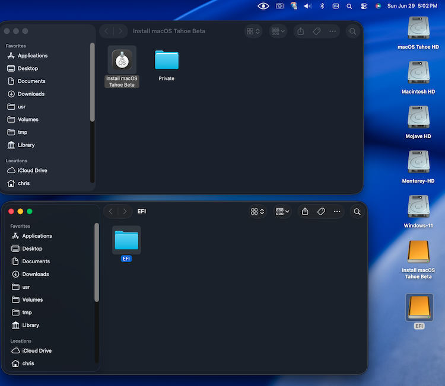
